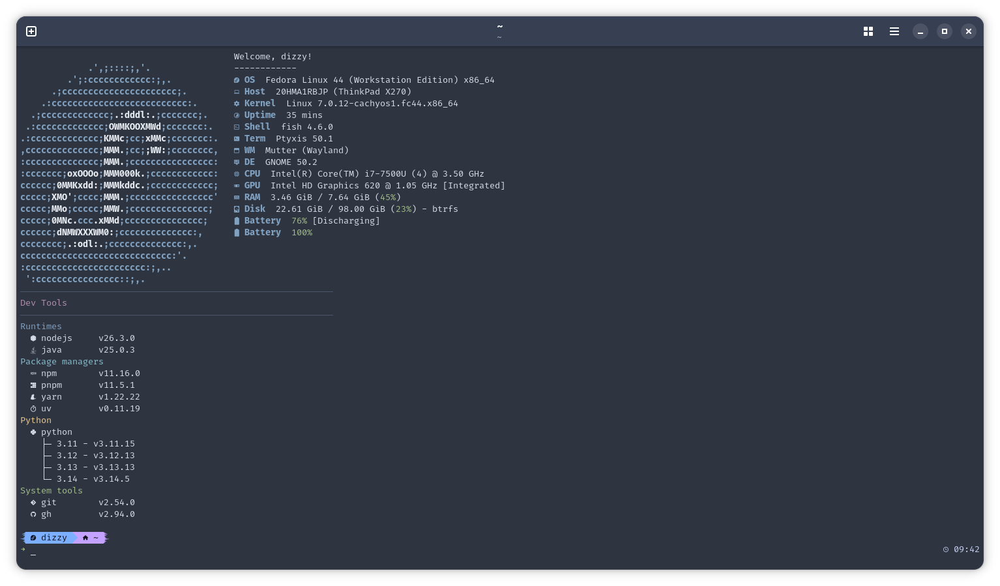
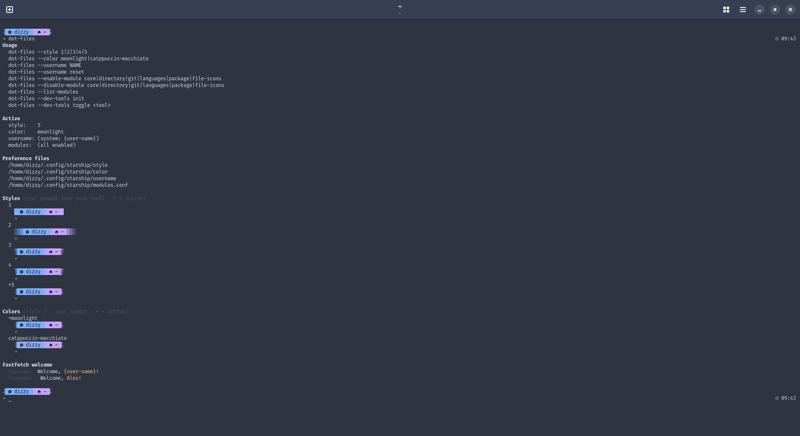

<div align="center">

# dot-files

**A portable, modular terminal environment for Fish, Starship, and Fastfetch.**

[](https://fishshell.com/)
[](https://starship.rs/)
[](https://github.com/fastfetch-cli/fastfetch)
[](#requirements)
[](LICENSE)

<br />



</div>

---

A clean, reproducible terminal setup built around the [Fish shell](https://fishshell.com/).
It pairs a [Starship](https://starship.rs/) prompt with a [Fastfetch](https://github.com/fastfetch-cli/fastfetch)
system summary and a dedicated **Dev Tools** block, all driven by plain-text preference
files and a single `dot-files` command — no hardcoded usernames or machine-specific paths.

## Contents

- [Highlights](#highlights)
- [Shell support](#shell-support)
- [Requirements](#requirements)
- [Installation](#installation)
- [The `dot-files` command](#the-dot-files-command)
- [Preference files](#preference-files)
- [Prompt styles](#prompt-styles)
- [Color themes](#color-themes)
- [What the installer does](#what-the-installer-does)
- [Repository layout](#repository-layout)
- [Documentation](#documentation)

## Highlights

- **Modular Fish configuration** — composable `conf.d/`, `functions/`, and `completions/` units.
- **Starship prompt** — five switchable separator styles and per-theme color palettes.
- **Fastfetch summary** — a startup overview followed by a separate, auto-pruned Dev Tools block.
- **One command to rule them** — `dot-files` adjusts styles, colors, modules, and tool visibility.
- **Preference-driven** — everyday options live in simple text files; source files stay untouched.
- **Icon-aware `ls` fallback** — graceful listings even without `eza` or `lsd`.
- **Safe installer** — backup, symlink, copy, dry-run, and curl-based installation.

## Shell support

This repository ships **Fish integration only**. Fish functions, `conf.d` snippets, and
install-time steps (such as Starship config generation) assume Fish — set Fish as your
login shell before installing.

| Shell | Supported |
| :--- | :---: |
| Fish | ✅ Required |
| Zsh | ❌ |
| Bash | ❌ |
| Other | ❌ |

> Starship and Fastfetch configs are shell-agnostic once installed, but only Fish helpers
> (`starship init fish`, `dot-files`, `starship-rebuild`, …) are provided here.

## Requirements

**Required**

- [Fish shell](https://fishshell.com/) — your daily login / interactive shell
- [Starship](https://starship.rs/)
- [Fastfetch](https://github.com/fastfetch-cli/fastfetch)
- Git — for the curl-based and clone-based installs
- A [Nerd Font](https://www.nerdfonts.com/) terminal font — **FiraCode Nerd Font** recommended ([download FiraCode.zip](https://github.com/ryanoasis/nerd-fonts/releases/download/v3.4.0/FiraCode.zip) · [all releases](https://github.com/ryanoasis/nerd-fonts/releases/latest))

> **Install FiraCode Nerd Font (Linux):**
>
> ```sh
> mkdir -p ~/.local/share/fonts
> curl -fsSL -o /tmp/FiraCode.zip https://github.com/ryanoasis/nerd-fonts/releases/download/v3.4.0/FiraCode.zip
> unzip -o /tmp/FiraCode.zip -d ~/.local/share/fonts/FiraCode
> fc-cache -f
> ```
>
> Then set **FiraCode Nerd Font** as your terminal font. Without a Nerd Font, the prompt and Fastfetch icons render as missing glyphs (□/▯).

**Detected automatically by the Dev Tools block**

- Runtimes — Node.js, Deno, Bun, Go, Rust, Java
- Package managers — npm, pnpm, yarn
- Python interpreters exposed as `python3.x`
- Tooling — Git, GitHub CLI, Docker, Docker Compose, kubectl
- `eza` or `lsd` for richer listings (the bundled Fish `ls` fallback is used otherwise)

## Installation

### Quick install (curl)

Downloads `install.sh`, shallow-clones the repository to `~/.local/share/dotfiles`,
installs the configs, and generates the Starship settings with Fish.

```sh
curl -fsSL https://raw.githubusercontent.com/D1ZZY4/dot-files/main/install.sh | sh
```

Copy files instead of symlinking:

```sh
curl -fsSL https://raw.githubusercontent.com/D1ZZY4/dot-files/main/install.sh | sh -s -- --copy
```

Preview without applying any changes:

```sh
curl -fsSL https://raw.githubusercontent.com/D1ZZY4/dot-files/main/install.sh | sh -s -- --dry-run
```

### Clone and install

Use this if you want a local checkout to edit before or after installing.

```sh
git clone https://github.com/D1ZZY4/dot-files.git ~/.local/share/dotfiles
cd ~/.local/share/dotfiles
./install.sh            # symlink (default)
./install.sh --copy     # copy files instead of symlinking
./install.sh --dry-run  # preview only
```

Install with a custom welcome title:

```sh
./install.sh --welcome "Your Name"
```

After installing, restart Fish or run:

```fish
exec fish
```

> **Forking?** Replace `D1ZZY4/dot-files` with your own `<user>/<repo>` in the commands
> above, and set `DOTFILES_REPO_URL` near the top of `install.sh` so the curl one-liner
> points at your repository.

## The `dot-files` command

A single Fish helper manages everything at runtime — run `dot-files` with no arguments to
see active settings, preference paths, live style/color previews, and the welcome format.

<div align="center">



</div>

```fish
dot-files                      # show paths, active settings, and previews

# Prompt appearance
dot-files --style 5
dot-files --color moonlight
dot-files --color catppuccin-macchiato

# Welcome name
dot-files --username "Your Name"
dot-files --username reset     # back to the system username

# Starship modules (core is always on)
dot-files --list-modules
dot-files --enable-module git
dot-files --disable-module git

# Fastfetch Dev Tools block
dot-files --dev-tools init
dot-files --dev-tools toggle docker
```

## Preference files

Everyday options live in plain-text files — lines starting with `#` are comments.

| File | Purpose |
| :--- | :--- |
| `~/.config/starship/style` | Prompt separator `1`–`5` |
| `~/.config/starship/color` | Palette: `moonlight` or `catppuccin-macchiato` |
| `~/.config/starship/username` | Fastfetch welcome name |
| `~/.config/starship/modules.conf` | Enabled Starship modules (created on first toggle) |
| `~/.config/starship/dev-tools.toml` | Dev Tools visibility (created by `--dev-tools init`) |

Leave `username` empty (comments only) to use your **system username**
(`Welcome, {user-name}!`). Add a single line such as `Alex` for a custom title, then run
`fastfetch-apply-welcome` or open a new Fish session.

## Prompt styles

Style **5** is the default. Switch with `dot-files --style <n>`.

```text
style 1 : █ … █
style 2 : ░▒▓ … ▓▒░
style 3 :  … 
style 4 :  … 
style 5 :  … 
```

## Color themes

Themes live in `config/starship/colors/`, each with its own Starship palette
(`palettes.moonlight`, `palettes.catppuccin-macchiato`). The active theme is selected with
`dot-files --color`, written to `~/.config/starship/color`, and applied on rebuild.

| Theme | Palette |
| :--- | :--- |
| `moonlight` | `palettes.moonlight` |
| `catppuccin-macchiato` | `palettes.catppuccin-macchiato` |

## What the installer does

1. Installs `config/fish` into `~/.config/fish`
2. Installs `config/starship` into `~/.config/starship`
3. Installs `config/fastfetch` into `~/.config/fastfetch`
4. Generates `~/.config/starship/starship.toml` (requires Fish)
5. Links `~/.config/starship.toml` to the generated Starship config
6. Backs up replaced files under `~/.dotfiles-backup/<timestamp>`

`config/starship/starship.toml` is intentionally **not committed** — it is generated from
the modular source files by:

```fish
starship-rebuild
# or
fish ~/.config/starship/build.fish
```

## Repository layout

```text
.
├── assets/
│   └── preview/            # screenshots used in this README
├── config/
│   ├── fastfetch/          # Fastfetch config + Dev Tools detection
│   ├── fish/               # conf.d, functions, completions
│   └── starship/
│       ├── colors/         # color themes
│       ├── modules/        # modular prompt segments
│       ├── style           # preference: separator 1–5
│       ├── color           # preference: palette name
│       └── username        # preference: Fastfetch welcome name
├── docs/                   # detailed guides
├── install.sh
├── LICENSE
└── README.md
```

## Documentation

- [Installation Guide](docs/installation.md)
- [Customization Guide](docs/customization.md)
- [Starship Guide](docs/starship.md)
- [Fish Guide](docs/fish.md)
- [Troubleshooting](docs/troubleshooting.md)

---

<div align="center">

This repository avoids hardcoded usernames and machine-specific home paths — runtime paths
resolve through `$HOME`, `$XDG_CONFIG_HOME`, and command discovery wherever practical.

Licensed under the [MIT License](LICENSE).

</div>
